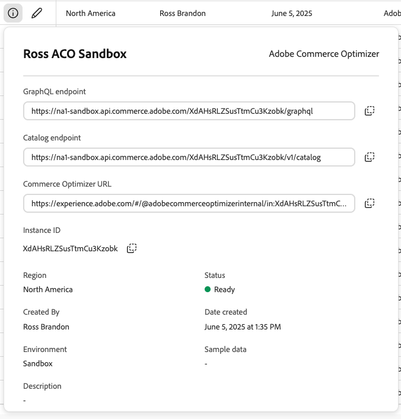

# Adobe Commerce Optimizer Typescript SDK

The Adobe Commerce Optimizer TypeScript SDK for Javascript/Typescript provides an easy integration point with the Adobe
Commerce Optimizer Data Ingestion API. With this SDK, you do not need to manage the full integration with catalog
ingestion APIs and IMS authentication methods. Simply follow the guide below to install and begin using the ACO client
SDK directly in your codebase.

For complete Merchandising Services documentation, visit the
[Adobe Developer Documentation](https://developer-stage.adobe.com/commerce/services/composable-catalog/) site.

**Note:** Adobe also provides the [Commerce Optimizer Java SDK](https://github.com/adobe-commerce/aco-java-sdk) for Java
project integrations.

## Install the SDK

```bash
npm install @adobe-commerce/aco-ts-sdk
```

## Initialize the SDK

To get started ingesting your catalog into Commerce Optimizer, you first need to create the client. In order to do this,
use the `createClient` function provided in the `@adobe-commerce/aco-ts-sdk` package. The `createClient` function
accepts a client configuration object of type `ClientConfig`. The `ClientConfig` object requires the following:

- `credentials`: The credentials object contains the IMS fields needed to authenticate with the ACO APIs
  - `clientId`: This is your client id found in the Adobe Developer Console..
  - `clientSecret`: This is your client secret found in the Adobe Developer Console..
- `tenantId`: This is the identifier for your ACO instance..
- `region`: This is the region in which your ACO instance is deployed. Example: `na1`..
- `environment`: This is your ACO instance's environment type: `sandbox` or `production`

### Get credentials and tenant ID for your instance

You need the following values to authenticate requests to ingest data from the sample data set to your Adobe Commerce
Optimizer instance.

- **Tenant_ID**—Identifies the Adobe Commerce Optimizer instance targeted for data ingestion.
- **Adobe IMS `clientId` and `clientSecret` credentials**—These authentication credentials are required to authenticate
  API requests for data ingestion. You create these credentials from the Adobe Developer Console, which requires an
  Adobe account with developer access to the Adobe Commerce Optimizer.

#### Get your tenant ID, region, and environment

Find your tenant ID in the access URLs for your Commerce Optimizer instance in Cloud Manager.

1. Log in to your [Adobe Experience Cloud](https://experience.adobe.com/) account.

1. Under **Quick access**, click **Commerce** to open the Commerce Cloud Manager.

   The Commerce Cloud Manager displays a list of instances that are available in your Adobe IMS organization.

1. To view the access URLs including the base URL for the REST and GraphQL APIs, click the information icon next to the
   instance name.

   

   **Note:** If you don't have access to the Commerce Cloud Manager, contact your system administrator.

1. Your tenant ID, region, and environment are included in the endpoint details. For example, you can see it in the
   Catalog Endpoint that follows this pattern:

   `https://{region}[-sandbox].api.commerce.adobe.com/{tenantId}/v1/catalog`

For example, if your endpoint URL is `https://na1-sandbox.api.commerce.adobe.com/XdAHsRLZSusTtmCu3Kzobk/v1/catalog` then
your configuration variables are as follows:

- `tenantId`: `XdAHsRLZSusTtmCu3Kzobk`
- `region`: `na1`
- `environment`: `sandbox`

_Note:_ Only the `sandbox` environment type will have its `environment` explicitly designated in the URL. If the
environment type is `production`, then the `environment` will be omitted from the URL. Example:

- Sandbox: `https://na1-sandbox.api.commerce.adobe.com/XdAHsRLZSusTtmCu3Kzobk/v1/catalog`
- Production: `https://na1.api.commerce.adobe.com/XdAHsRLZSusTtmCu3Kzobk/v1/catalog`

#### Generate the IMS credentials for API authentication

You generate the `clientId` and `clientSecret` credentials from the Adobe Developer Console. You must have a system
administrator or developer role for the Adobe Commerce Optimizer project to complete this configuration. See
[User Management](https://helpx.adobe.com/enterprise/using/manage-developers.html) in the _Adobe Commerce Optimizer_
documentation.

1. Log in to the [Adobe Developer Console](https://developer.adobe.com/console).

1. Select the Experience Cloud Organization for the integration.

1. Create an API project.

   - Add the **Adobe Commerce Optimizer Ingestion** API to your project. Then, click **Next**.

   - Select the **Default - Cloud Manager** profile.

   - Click **Save configured API**.

1. In the Connected Credentials section, view API configuration details by selecting **OAUTH Server-to-Server**.

   

1. Copy the Client ID and the Client Secret values to a secure location.

### Example:

```typescript
import {
  createClient,
  consoleLogger,
  Client,
  ClientConfig,
  Environment,
  LogLevel,
  Region,
} from '@adobe-commerce/aco-ts-sdk';

// Define your configuration
const config: ClientConfig = {
  credentials: {
    clientId: 'my-client-id', // Your IMS client id from Dev Console
    clientSecret: 'my-client-secret', // Your IMS client secret from Dev Console
  },
  tenantId: 'my-tenant-id', // Your instance's tenant id found in Commerce Cloud Manager UI
  region: 'na1' as Region, // Your instance's region found in Commerce Cloud Manager UI
  environment: 'sandbox' as Environment, // Your instance's environment type: sandbox or production
  timeoutMs: 30000, // Optional. HTTP timeout override in ms. Default is 10000ms
  logger: consoleLogger(LogLevel.DEBUG), // Optional. Pass in your existing logger. If not provided, a default console logger is used. See Types -> Logger section below.
};

// Initialize the client instance
const client: Client = createClient(config);
```

Once the `client` is initialized, you can begin ingesting your catalog data into Commerce Optimizer!

## Ingest Catalog Data

The Commerce Optimizer SDK Client provides the ability to easily manage the following entities in your catalog:

- Products
- Product Metadata
- Price Books
- Prices

### Product Operations

#### Create Products

```typescript
import { FeedProduct, FeedProductStatusEnum, FeedProductVisibleInEnum } from '@adobe-commerce/aco-ts-sdk';

const product1: FeedProduct = {
  sku: 'EXAMPLE-SKU-001',
  source: { locale: 'en-US' },
  name: 'Example Product 1',
  slug: 'example-product-1',
  description: 'This is an example product created via the SDK',
  status: FeedProductStatusEnum.Enabled,
  visibleIn: [FeedProductVisibleInEnum.Catalog, FeedProductVisibleInEnum.Search],
  attributes: [
    {
      code: 'brand',
      values: ['Example Brand'],
    },
  ],
};

const product2: FeedProduct = {
  sku: 'EXAMPLE-SKU-002',
  source: { locale: 'en-US' },
  name: 'Example Product 2',
  slug: 'example-product-2',
  description: 'This is another example product created via the SDK',
  status: FeedProductStatusEnum.Enabled,
  visibleIn: [FeedProductVisibleInEnum.Catalog, FeedProductVisibleInEnum.Search],
  attributes: [
    {
      code: 'brand',
      values: ['Example Brand'],
    },
  ],
};

const response = await client.createProducts([product1, product2]);
// response.data: { status: 'ACCEPTED', acceptedCount: 2 }
```

#### Update Products

```typescript
import { FeedProductUpdate } from '@adobe-commerce/aco-ts-sdk';

const productUpdate: FeedProductUpdate = {
  sku: 'EXAMPLE-SKU-001',
  source: { locale: 'en-US' },
  name: 'Updated Product Name',
};

const response = await client.updateProducts([productUpdate]);
// response.data: { status: 'ACCEPTED', acceptedCount: 1 }
```

#### Delete Products

```typescript
import { FeedProductDelete } from '@adobe-commerce/aco-ts-sdk';

const productDelete: FeedProductDelete = {
  sku: 'EXAMPLE-SKU-001',
  source: { locale: 'en-US' },
};

const response = await client.deleteProducts([productDelete]);
// response.data: { status: 'ACCEPTED', acceptedCount: 1 }
```

### Product Metadata Operations

#### Create Product Metadata

```typescript
import { FeedMetadata, FeedMetadataDataTypeEnum, FeedMetadataVisibleInEnum } from '@adobe-commerce/aco-ts-sdk';

const metadata: FeedMetadata = {
  code: 'color',
  source: { locale: 'en-US' },
  label: 'Color',
  dataType: FeedMetadataDataTypeEnum.Text,
  visibleIn: [FeedMetadataVisibleInEnum.ProductDetail],
  filterable: true,
  sortable: true,
  searchable: true,
};

const response = await client.createProductMetadata([metadata]);
// response.data: { status: 'ACCEPTED', acceptedCount: 1 }
```

#### Update Product Metadata

```typescript
import { FeedMetadataUpdate } from '@adobe-commerce/aco-ts-sdk';

const metadataUpdate: FeedMetadataUpdate = {
  code: 'color',
  source: { locale: 'en-US' },
  label: 'Updated Color Label',
};

const response = await client.updateProductMetadata([metadataUpdate]);
// response.data: { status: 'ACCEPTED', acceptedCount: 1 }
```

#### Delete Product Metadata

```typescript
import { FeedMetadataDelete } from '@adobe-commerce/aco-ts-sdk';

const metadataDelete: FeedMetadataDelete = {
  code: 'color',
  source: { locale: 'en-US' },
};

const response = await client.deleteProductMetadata([metadataDelete]);
// response.data: { status: 'ACCEPTED', acceptedCount: 1 }
```

### Price Book Operations

#### Create Price Books

```typescript
import { FeedPricebook } from '@adobe-commerce/aco-ts-sdk';

const pricebook: FeedPricebook = {
  priceBookId: 'default',
  name: 'Default Price Book',
  currency: 'USD',
};

const response = await client.createPriceBooks([pricebook]);
// response.data: { status: 'ACCEPTED', acceptedCount: 1 }
```

#### Update Price Books

```typescript
import { FeedPricebook } from './src/types';

const pricebookUpdate: FeedPricebook = {
  priceBookId: 'default',
  name: 'Updated Price Book Name',
};

const response = await client.updatePriceBooks([pricebookUpdate]);
// response.data: { status: 'ACCEPTED', acceptedCount: 1 }
```

#### Delete Price Books

```typescript
import { FeedPricebook } from '@adobe-commerce/aco-ts-sdk';

const pricebookDelete: FeedPricebook = {
  priceBookId: 'default',
};

const response = await client.deletePriceBooks([pricebookDelete]);
// response.data: { status: 'ACCEPTED', acceptedCount: 1 }
```

### Price Operations

#### Create Prices

```typescript
import { FeedPrices } from '@adobe-commerce/aco-ts-sdk';

const price: FeedPrices = {
  sku: 'EXAMPLE-SKU-001',
  priceBookId: 'default',
  regular: 99.99,
};

const response = await client.createPrices([price]);
// response.data: { status: 'ACCEPTED', acceptedCount: 1 }
```

#### Update Prices

```typescript
import { FeedPricesUpdate } from '@adobe-commerce/aco-ts-sdk';

const priceUpdate: FeedPricesUpdate = {
  sku: 'EXAMPLE-SKU-001',
  priceBookId: 'default',
  regular: 99.99,
};

const response = await client.updatePrices([priceUpdate]);
// response.data: { status: 'ACCEPTED', acceptedCount: 1 }
```

#### Delete Prices

```typescript
import { FeedPricesDelete } from '@adobe-commerce/aco-ts-sdk';

const priceDelete: FeedPricesDelete = {
  sku: 'EXAMPLE-SKU-001',
  priceBookId: 'default',
};

const response = await client.deletePrices([priceDelete]);
// response.data: { status: 'ACCEPTED', acceptedCount: 1 }
```

## Types

See the [types.ts](https://github.com/adobe-commerce/aco-ts-sdk/blob/main/src/types.ts) file for all exported type
definitions.

### Client Config

The `ClientConfig` object is required to be passed into the `createClient` function. It configures how the SDK client
will interact with Adobe Commerce Optimizer services.

```typescript
/**
 * Client configuration
 *
 * @param credentials - Adobe IMS credentials for authentication
 * @param tenantId - The tenant ID for the API requests
 * @param region - The region for the API endpoint (e.g., 'us', 'eu')
 * @param environment - The environment to use ('production' or 'sandbox')
 * @param timeoutMs - The timeout for the API requests
 * @param logger - Optional logger for customizing logging behavior
 */
export interface ClientConfig {
  credentials: AdobeCredentials;
  tenantId: string;
  region: Region;
  environment: Environment;
  timeoutMs?: number;
  logger?: Logger;
}
```

### Logger

The Adobe Commerce Optimizer SDK provides flexible logging capabilities through the `Logger` interface. You can either
use the default console logger or implement your own logger that matches the interface.

#### Default Logger

The default console logger that can be used like this:

```typescript
import { consoleLogger, ClientConfig, LogLevel } from '@adobe-commerce/aco-ts-sdk';

const config: ClientConfig = {
  // ... other config options ...
  logger: consoleLogger(LogLevel.INFO), // Uses default console logger
};
```

#### Custom Logger

You can implement your own logger by creating an object that implements the `Logger` interface. This is useful for
integrating with your existing logging infrastructure and customizing log formats.

```typescript
/**
 * Logger interface for customizing logging behavior
 *
 * @param debug - Log a debug message
 * @param info - Log an info message
 * @param warn - Log a warning message
 * @param error - Log an error message
 */
export interface Logger {
  debug(message: string, meta?: Record<string, unknown>): void;
  info(message: string, meta?: Record<string, unknown>): void;
  warn(message: string, meta?: Record<string, unknown>): void;
  error(message: string, error?: Error, meta?: Record<string, unknown>): void;
}

/**
 * Log level
 *
 * @param DEBUG - Debug log level
 * @param INFO - Info log level
 * @param WARN - Warning log level
 * @param ERROR - Error log level
 */
export enum LogLevel {
  DEBUG = 0,
  INFO = 1,
  WARN = 2,
  ERROR = 3,
}
```

##### Using Winston

The [Winston Logger](https://github.com/winstonjs/winston) interface matches the SDK's `Logger` interface and is a
drop-in logger override.

```typescript
import winston from 'winston';

const logger = winston.createLogger({
  level: 'debug',
  format: winston.format.json(),
  transports: [new winston.transports.Console()],
});
// ...
const config: ClientConfig = {
  // ... other config options ...
  logger, // Uses winston logger from your application
};
```

##### Using Pino

The [Pino Logger](https://getpino.io) interface does not exactly match the SDK's `Logger` interface, but can be easily
adapted to be provided as a logger override.

```typescript
import pino from 'pino';

// Create a simple adaptor for the Pino logger interface
const createPinoAdapter = pinoInstance => {
  const logWithMetadata = (level, message, ...args) => {
    const metadata = args[0];
    if (metadata && typeof metadata === 'object' && metadata !== null) {
      pinoInstance[level](metadata, message);
    } else {
      pinoInstance[level](message, ...args);
    }
  };

  return {
    debug: (message, ...args) => logWithMetadata('debug', message, ...args),
    info: (message, ...args) => logWithMetadata('info', message, ...args),
    warn: (message, ...args) => logWithMetadata('warn', message, ...args),
    error: (message, error, ...args) => {
      if (error instanceof Error) {
        const metadata = args[0];
        if (metadata && typeof metadata === 'object' && metadata !== null) {
          pinoInstance.error({ ...metadata, err: error }, message);
        } else {
          pinoInstance.error({ err: error }, message);
        }
      } else if (error && typeof error === 'object') {
        pinoInstance.error(error, message);
      } else {
        pinoInstance.error(message);
      }
    },
  };
};
const logger = createPinoAdapter(pino({ level: 'debug' }));
// ...
const config: ClientConfig = {
  // ... other config options ...
  logger, // Uses pino logger from your application
};
```
